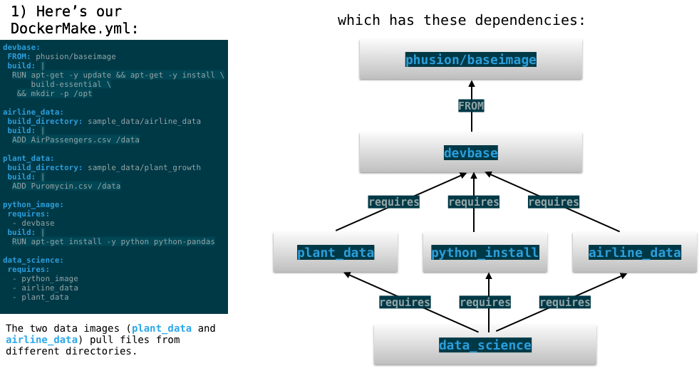
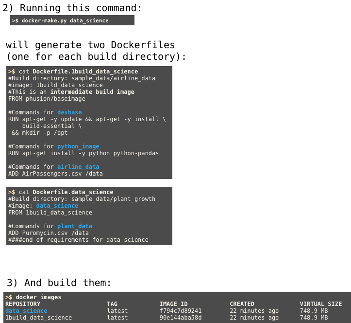

# Docker-make
Build and manage stacks of docker images - a dependency graph for Docker images
 
[](https://travis-ci.org/avirshup/DockerMake)

Table of Contents
=================
 * [Install](#Install)
 * [Run it](#Run-it)
 * [What you can do with it](#what-you-can-do-with-it)
 * [Example](#example)
 * [Writing DockerMake\.yaml](#writing-dockermakeyaml)
 * [Requirements](#requirements)
 * [Command line usage](#command-line-usage)


### Install

Requires [Docker](https://www.docker.com/products/docker), and Python (2.7 or 3.4+).

```
pip install dockermake 
```

This will install the command line tool, `docker-make`, and its supporting python package, which you can import as `import dockermake`. 


### Run it

To build some illustrative examples, try running the example in this repository:

```bash
git clone https://github.com/avirshup/DockerMake
cd DockerMake/example
docker-make --list
docker-make final
```


### What you can do with it
 * **New**: Build an artifact (such as an executable or library) in one image, then copy it into a smaller image for deployment
 * **New**: easily invalidate the docker image cache at an arbitrary layer
 * Define small pieces of configuration or functionality, then mix them together into production docker images.
 * "Inherit" Dockerfile instructions from multiple sources
 * Easily manage images that pull files from multiple directories on your filesystem
 * Easily manage images that pull binaries from other _docker images_ that you've defined
 * Build and push an entire stack of images with a single command
 

### Example
[Click here to see how we're using this in production.](https://github.com/Autodesk/molecular-design-toolkit/tree/master/DockerMakefiles)

This example builds a single docker image called `data_science`. It does this by mixing together three components: `devbase` (the base image), `airline_data` (a big CSV file), and `python_image` (a python installation). `docker-make` will create an image that combines all of these components.

Here's the `DockerMake.yml` file:
```yaml
devbase:
 FROM: phusion/baseimage
 build: |
  RUN apt-get -y update && apt-get -y install 
      build-essential 
   && mkdir -p /opt

airline_data:
 build_directory: sample_data/airline_data
 build: |
  ADD AirPassengers.csv /data

plant_data:
 build_directory: sample_data/plant_growth
 build: |
  ADD Puromycin.csv /data

python_image:
 requires:
  - devbase
 build: |
  RUN apt-get install -y python python-pandas

data_science:
 requires:
  - python_image
  - airline_data
  - plant_data

```

To build an image called `alice/data_science`, you can run:
```bash
docker-make data_science --repository alice
```
which will create an image with all the commands in `python_image` and `airline_data`.

This works by dynamically generating a new Dockerfile every time you ask to build something. However, most of the commands will be cached, especially if you have a large hierarchy of base images. This actually leads to _less_ rebuilding than if you had a series of Dockerfiles linked together with `FROM` commands.

Here's the dependency graph and generated Dockerfiles:




### Writing DockerMake.yaml
The idea is to write dockerfile commands for each specific piece of functionality in the `build` field, and "inherit" all other functionality from a list of other components that your image `requires`. If you need to add files with the ADD and COPY commands,  specify the root directory for those files with `build_directory`. Your tree of "requires" must have _exactly one_ unique named base image in the `FROM` field.
```yaml
[image_name]:
  requires:
    - [other image name]
    - [yet another image name]
    [...]
  FROM: [named_base_image]
  build: |
    RUN [something]
    ADD [something else]
    [Dockerfile commands go here]
  build_directory: [path where the ADD and COPY commands will look for files]
    # note that the "build_directory" path can be relative or absolute.
    # if it's relative, it's interpreted relative to DockerMake.yml's directory
  copy_from:  # Note: the copy_from commands will always run AFTER any build commands
    [source_image]:
       [source path1]:[destination path1]
       [source path2]:[destination path2]
       [...]
    [source_image_2]:
       [...]
   

[other image name]: [...]
[...]
```


#### Requirements
Run `docker-make.py` from wherever you like. You'll need python2.7, pyyaml, docker-py, and access to a docker daemon. If you have pip and a docker-machine, you can run these commands to get set up:
```bash
pip install pyyaml docker-py
eval $(docker-machine env [machine-name])
```

### Command line usage 
```
usage: docker-make [-h] [-f MAKEFILE] [-a] [-l]
                   [--requires [REQUIRES [REQUIRES ...]]] [--name NAME] [-p]
                   [-n] [--pull] [--no-cache] [--bust-cache BUST_CACHE]
                   [--clear-copy-cache] [--repository REPOSITORY] [--tag TAG]
                   [--push-to-registry] [--version] [--help-yaml]
                   [TARGETS [TARGETS ...]]

NOTE: Docker environmental variables must be set. For a docker-machine, run
`eval $(docker-machine env [machine-name])`

optional arguments:
  -h, --help            show this help message and exit

Choosing what to build:
  TARGETS               Docker images to build as specified in the YAML file
  -f MAKEFILE, --makefile MAKEFILE
                        YAML file containing build instructions
  -a, --all             Print or build all images (or those specified by
                        _ALL_)
  -l, --list            List all available targets in the file, then exit.
  --requires [REQUIRES [REQUIRES ...]]
                        Build a special image from these requirements.
                        Requires --name
  --name NAME           Name for custom docker images (requires --requires)

Dockerfiles:
  -p, --print-dockerfiles, --print_dockerfiles
                        Print out the generated dockerfiles named
                        `Dockerfile.[image]`
  -n, --no_build        Only print Dockerfiles, don't build them. Implies
                        --print.

Image caching:
  --pull                Always try to pull updated FROM images
  --no-cache            Rebuild every layer
  --bust-cache BUST_CACHE
                        Force docker to rebuilt all layers in this image. You
                        can bust multiple image layers by passing --bust-cache
                        multiple times.
  --clear-copy-cache, --clear-cache
                        Remove docker-make's cache of files for `copy_from`.

Repositories and tags:
  --repository REPOSITORY, -r REPOSITORY, -u REPOSITORY
                        Prepend this repository to all built images, e.g.
                        `docker-make hello-world -u quay.io/elvis` will tag
                        the image as `quay.io/elvis/hello-world`. You can add
                        a ':' to the end to image names into tags: `docker-
                        make -u quay.io/elvis/repo: hello-world` will create
                        the image in the elvis repository: quay.io/elvis/repo
                        :hello-world
  --tag TAG, -t TAG     Tag all built images with this tag. If image names are
                        ALREADY tags (i.e., your repo name ends in a ":"),
                        this will append the tag name with a dash. For
                        example: `docker-make hello-world -u elvis/repo: -t
                        1.0` will create the image "elvis/repo:hello-world-1.0
  --push-to-registry, -P
                        Push all built images to the repository specified
                        (only if image repository contains a URL) -- to push
                        to dockerhub.com, use index.docker.io as the registry)

Help:
  --version             Print version and exit.
  --help-yaml           Print summary of YAML file format and exit.
```


Written by Aaron Virshup, BioNano Group at Autodesk

Copyright (c) 2015-2017, Autodesk Inc. Released under the Apache 2.0 License.
